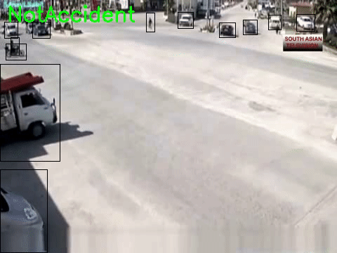
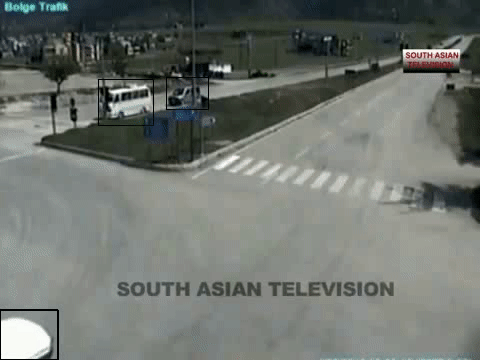
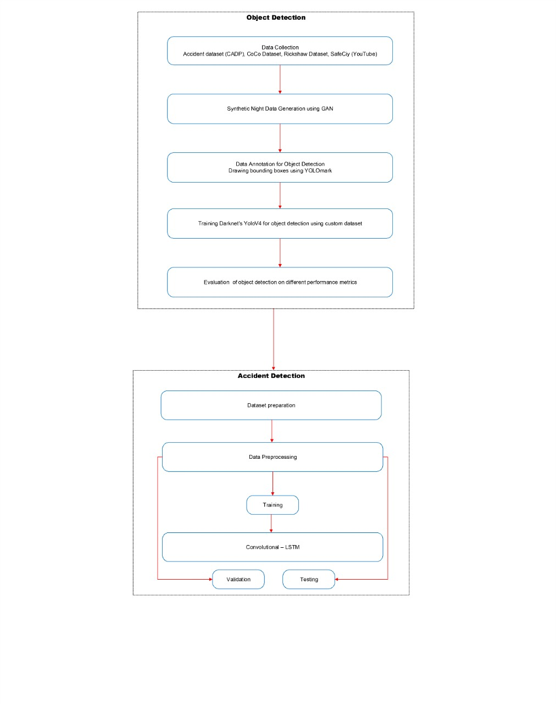
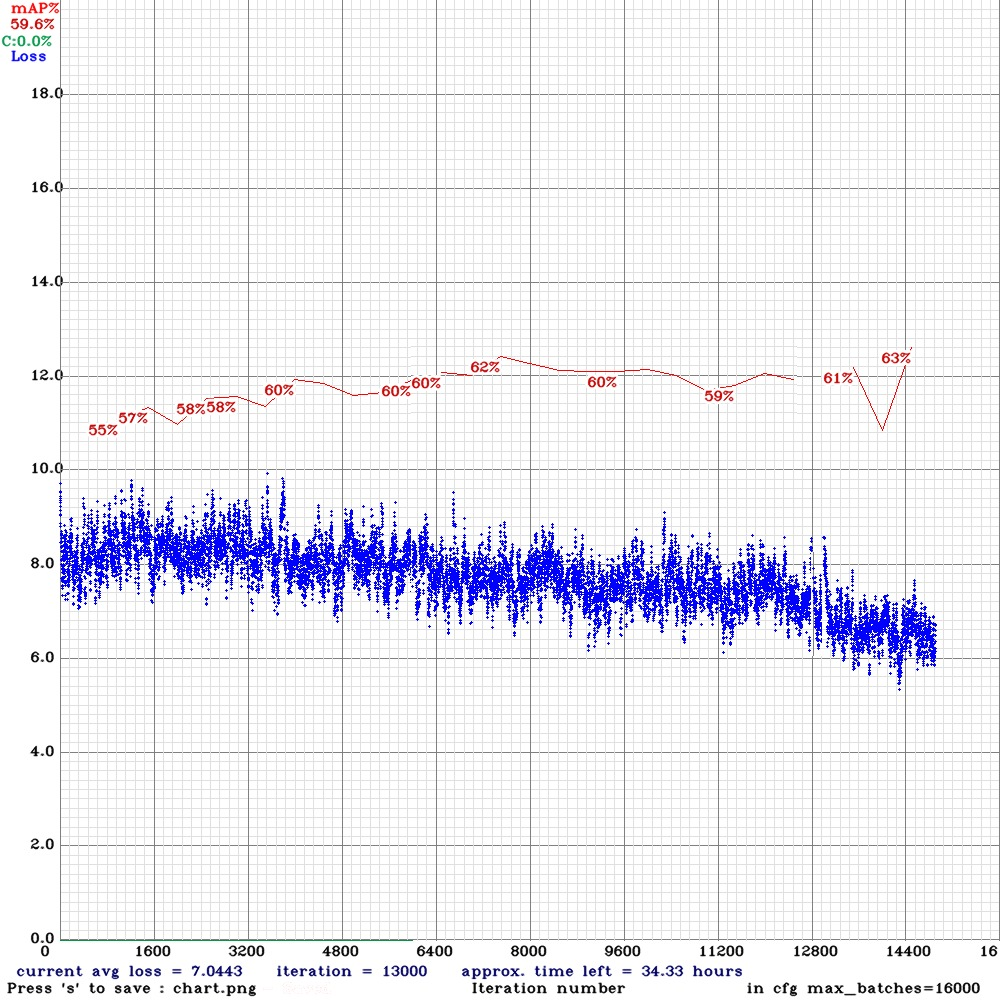
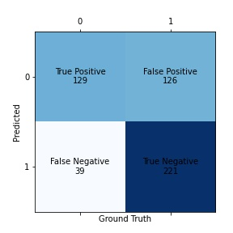
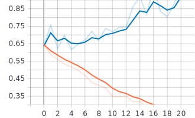

# Road Accident Detection

This project built a system that can detect any road accident occurrence in CCTV camera videos. 
It will reduce the delay in providing medical aid to the victims of
road accidents by informing the relevant authorities whenever it detects an accident.

### Problem Description

In a report of the World Health Organization (WHO), Approximately 1.35 million fatalities
occur during road accidents. 93% of the fatality counts belong to low and middle-income
countries. This is because of the lack of awareness in people living in these countries on what to
do when a road accident occures. This lack of awareness of the bystanders causes a delay in response to the victim,
which results in the loss of lives. 

If we could reduce this delay by detecting accidents automatically and sending the information 
of the accident to the traffic authorities or the nearest hospital, countless lives could be saved.

### Approach

- [x] Compile a data set from different sources (local vehicle data as well as coco data).
- [x] Annotate the data set in required format.
- [x] Use GANs to create Synthetic Night data.
- [x] Train YOLOv4 to perform obect detection on vehicles(including local vehicles) and people.
- [x] Perform object detection on CADP data set.
- [x] Train a Conv-LSTM model to detect accidents on the results of object detection.
- [x] Create a pipeline to perform inference, Object Detection -> Accident Detection on CCTV Videos.

Please refer to Accident_Detection Notebook to know more about the Accident Detection approach.

## Results

### Object Detection Results

**Object Detection MAP (Mean Avg. Precision) and Loss:**

### Accident Detection Results

**Confusion Matrix:**

**Epoch-Accuracy:**

🟠 Train 🔵 Validation

**Epoch-Loss:**

🟠 Train 🔵 Validation

### Dependencies
- Tensorflow 2.0
- Open CV
- darknet
- Numpy

### Instructions to Run

- Setup `darknet` by following the guide present [here](https://github.com/AlexeyAB/darknet).
- Replace the `yolo-obj.cfg`, present in the "cfg and weights" directory, in darknet.
- Replace the Object Detection weights available [here](https://drive.google.com/file/d/1hfFnNRzGct3yfDR8CaFnJS6i7N-KCedh/view?usp=sharing)
- Install all the dependencies.
- Run Accident_Detection.py

## Future Works (Steps to Improve)

- Instead of Object Detection and Localization, work on Accident Localization.
- Compile even more data for that purpose, the more the merrier.
